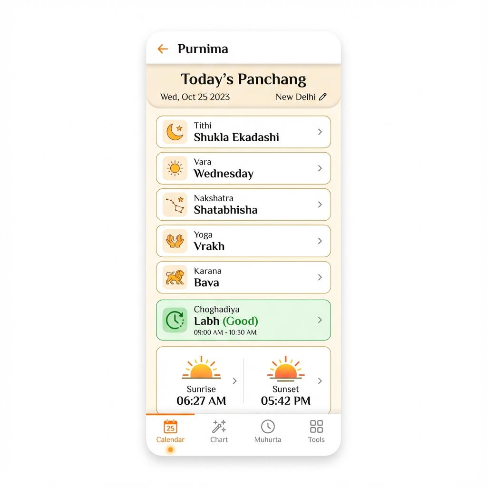
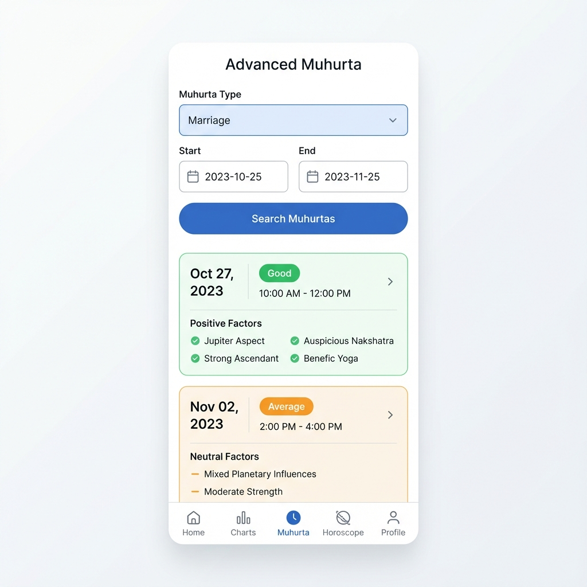
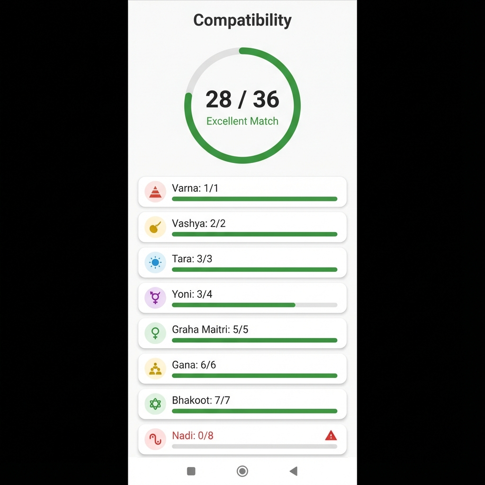

# Purnima - Vedic Astrology App

Purnima is a comprehensive Vedic Astrology application built with Flutter. It provides accurate Panchang data, Muhurta calculations, Birth Charts, and Compatibility matching (Asthakoot) based on ancient Vedic principles.

## Features

### 📅 Daily Panchang
Get detailed daily astrological data for any location:
- **Tithi, Vara, Nakshatra, Yoga, Karana**
- **Sunrise, Sunset, Moonrise, Moonset** timings
- **Choghadiya** (Day & Night) with color-coded nature indicators (Good/Bad/Neutral) based on backend calculations.

### ⏱️ Muhurta (Auspicious Timing)
Find the perfect time for important events:
- **Advanced Muhurta Search**: Search for auspicious slots for Marriage, Vehicle Purchase, Property Purchase, and more.
- View detailed quality indicators (Good/Average/Bad) and positive/negative factors for each slot.
- **Hora** and **Choghadiya** timings for quick reference.

### 🔮 Birth Chart (Kundli)
Generate detailed birth charts based on date, time, and place of birth.
- North and South Indian chart styles.
- Planetary positions and degrees.

### ❤️ Compatibility (Asthakoot)
Check marriage compatibility between two horoscopes.
- Detailed **Guna Milan** score (out of 36).
- Breakdown of Varna, Vashya, Tara, Yoni, Graha Maitri, Gana, Bhakoot, and Nadi.

### ⚙️ Other Features
- **Multi-language Support**: English, Hindi, Telugu, Tamil, Kannada, Sanskrit.
- **Location Support**: Automatic (GPS) and Manual location selection.
- **Offline Capable**: Caches data for better performance.

## Screenshots

| Home (Panchang) | Muhurta Search | Compatibility |
|:---:|:---:|:---:|
|  |  |  |

## Tech Stack

- **Framework**: Flutter (Dart)
- **State Management**: Provider
- **Networking**: Dio
- **Location**: Geolocator 
- **Storage**: Shared Preferences
- **Backend Architecture**: The app consumes a REST API for all astrological calculations.

## Getting Started

### Prerequisites
- Flutter SDK (3.10.x or later)
- Android Studio / Xcode for mobile development

### Installation

1. **Clone the repository**
   ```bash
   git clone https://github.com/RaviKarrii/purnima-flutter.git
   cd purnima-flutter
   ```

2. **Install dependencies**
   ```bash
   flutter pub get
   ```

3. **Run the app**
   ```bash
   flutter run
   ```

## Backend Integration Details

### Dynamic Color Coding
The app utilizes backend-driven color codes for Choghadiya and Muhurta slots to ensure consistent presentation across platforms and languages.
- **Green**: Auspicious (Amrit, Shubh, Labh)
- **Orange**: Neutral (Chal)
- **Red**: Inauspicious (Udveg, Rog, Kaal)

## License

This project is licensed under the MIT License - see the LICENSE file for details.
